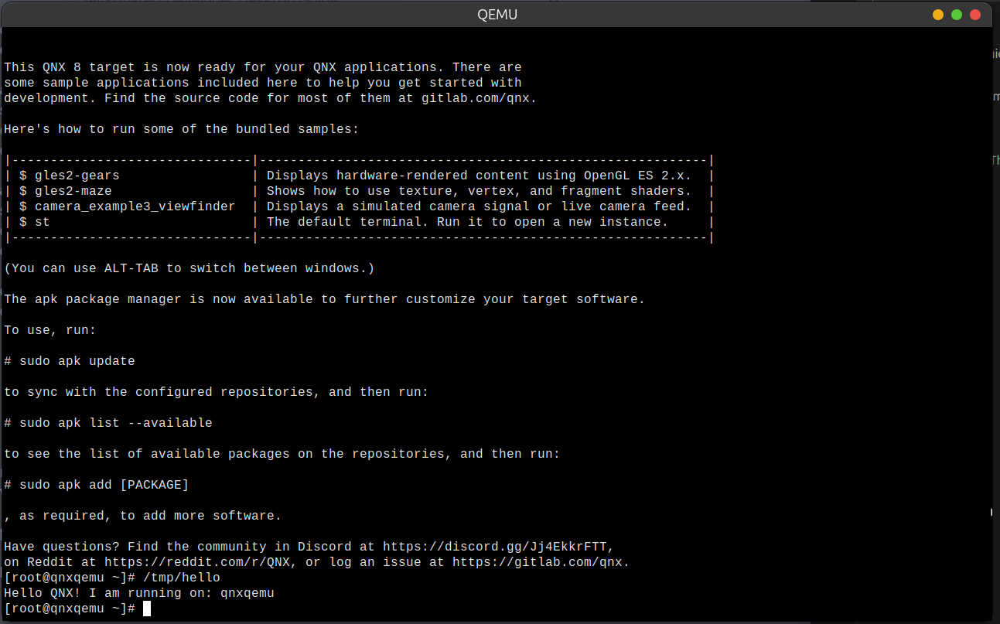

# Day 1: Introduction to QNX Architecture

Welcome to the first day of your QNX journey. Today, we will explore why QNX is different from Linux or Windows and why it is the OS of choice for mission-critical systems like cars, medical devices, and space stations.

## 1. The Microkernel Philosophy

Most modern operating systems (like Linux or Windows) use a **Monolithic Kernel**. In a monolithic design, the kernel contains almost everything: file systems, networking stacks, and device drivers. If a graphics driver crashes, the whole system might go down (Blue Screen of Death).

**QNX uses a Microkernel (Neutrino).**
In QNX, the kernel is tiny (usually < 100KB). It only handles:
- Signals
- Timers
- Scheduling
- **Message Passing** (The most important part!)

Everything else—file systems, drivers, network stacks—runs as **regular user processes** outside the kernel.

### Why does this matter?
1. **Robustness**: If the file system driver crashes, the kernel stays alive. You can simply restart the driver without rebooting the system.
2. **Real-time Performance**: The kernel is predictable and preemptible.
3. **Security**: Components are isolated from each other.

## 2. "Everything is a Process"

In Linux, we say "Everything is a file." In QNX, we say **"Everything is a process."**
- The filesystem is a process (`fs-qnx6`).
- The network stack is a process (`io-pkt-v6-hc`).
- Your USB driver is a process.

These processes communicate using **Message Passing**. This is the "secret sauce" we will master on Day 4.

## 3. Comparison Table

| Feature | Monolithic (Linux/Windows) | Microkernel (QNX Neutrino) |
|:---|:---|:---|
| **Kernel Size** | Large (Megabytes) | Tiny (Kilobytes) |
| **Drivers** | Inside the Kernel | Outside (User space) |
| **Fault Tolerance** | Low (Driver crash = Kernel panic) | High (Driver crash = Restart process) |
| **Communication** | System Calls | Message Passing |

---

## 🏁 Day 1 Mission

Your goal today is to setup your environment and see the Microkernel in action.

### 1. Installation & Environment Setup

For **QNX SDP 8.x (64-bit)**, the most reliable way to get started is by using the official **QNX Neutrino RTOS Guest VM** and following the official setup guide.

**Official Reference**: [QNX Getting Started with QEMU](https://www.qnx.com/developers/docs/qnxeverywhere/com.qnx.doc.target_images/topic/qsti_qemu/getting_started.html)

#### Summary of Steps:
1.  **Install SDP 8.x** via QNX Software Center.
2.  **Download the Target Image**: In QSC, look for the "QNX Neutrino RTOS Guest VM" (x86_64).
3.  **Run with QEMU**: Use the scripts provided in the BSP or the official command line provided in the documentation above to boot the image.
4.  **Avoid Environment Conflicts**: Remember to run QEMU in a terminal where the QNX environment is **NOT** sourced (or use `env -u LD_LIBRARY_PATH`) to avoid library symbol errors.

### 2. Observation Task
Once your QNX system is running:
1. **Open a terminal** inside the QNX target.
2. **Run**: 
   ```bash
   pidin
   ```
3. **Analysis**: Look at the output of `pidin`. Identify:
   - **PID 1**: This is `procnto`, the combined microkernel and process manager.
   - **System Services**: Can you see `slogger2`, `pci-server`, or `io-pkt-v6-hc`?
   - **Microkernel in action**: Notice how many drivers (network, disk, input) are running as separate user-space processes!

**Here is the Terminal when QNX is running on QEMU**
