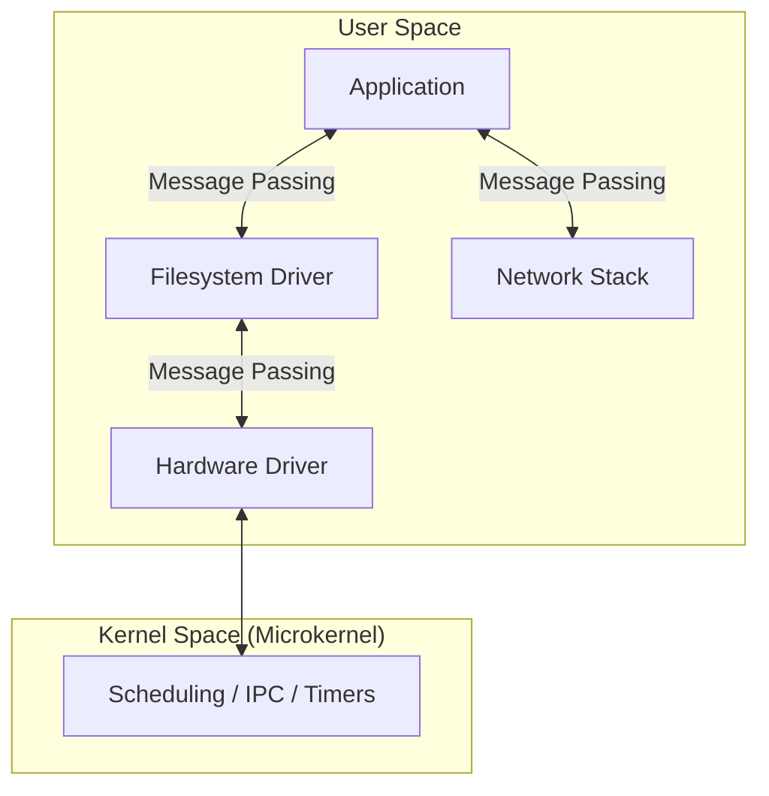

# Day 1: The Microkernel Revolution - QNX Architecture

Welcome to the first day of your QNX mastery journey. To understand QNX, you must first unlearn how traditional operating systems work. Today, we dive into the core philosophy that makes QNX the gold standard for mission-critical embedded systems.

## 1. Monolithic vs. Microkernel: The Paradigm Shift

Most developers are used to **Monolithic Kernels** (Linux, Windows, macOS). In these systems, the kernel is a massive program that handles everything: memory management, process scheduling, file systems, network stacks, and hardware drivers.

### The Problem with Monoliths
If a single driver (like a Wi-Fi driver) has a bug and crashes, it can corrupt kernel memory, leading to a total system failure (the infamous "Kernel Panic" or "Blue Screen").

### The QNX Solution: The Microkernel (Neutrino)
QNX uses a **Microkernel** architecture. The kernel is stripped down to its bare essentials—only about 100KB of code. It handles only:
- **Signals**: Basic process communication.
- **Timers**: Precision timing.
- **Scheduling**: Determining which thread runs next.
- **Message Passing**: The unified IPC mechanism.

Everything else—**drivers, filesystems, and network stacks—runs in User Space** as regular processes.



## 2. Key Architectural Pillars

### A. Fault Isolation
In QNX, if your USB driver crashes, the rest of the system remains unaffected. You can simply kill and restart the driver process without rebooting the hardware.

### B. High Predictability (Real-Time)
QNX is a **Hard Real-Time Operating System (RTOS)**. This means it doesn't just run fast; it runs **predictably**. When a high-priority event occurs, the kernel guarantees it will be handled within a fixed, microscopic amount of time (latency).

### C. Everything is a Process
In Linux, "everything is a file." In QNX, **"everything is a process."** When you write to a file, you are actually sending a message to a process that manages the disk. This uniformity is what makes QNX so flexible.

## 3. Comparison Table

| Feature | Monolithic (Linux/Windows) | Microkernel (QNX Neutrino) |
|:---|:---|:---|
| **Kernel Size** | Large (Megabytes) | Tiny (Kilobytes) |
| **Drivers** | Inside the Kernel | Outside (User space) |
| **Fault Tolerance** | Low (Driver crash = Kernel panic) | High (Driver crash = Restart process) |
| **Communication** | System Calls | Message Passing |

---

## 🏁 Day 1 Mission

Your goal today is to setup your environment and see the Microkernel in action.

### 1. Installation & Environment Setup

For **QNX SDP 8.x (64-bit)**, the most reliable way to get started is by using the official **QNX Neutrino RTOS Guest VM** and following the official setup guide.

**Official Reference**: [QNX Getting Started with QEMU](https://www.qnx.com/developers/docs/qnxeverywhere/com.qnx.doc.target_images/topic/qsti_qemu/getting_started.html)

#### Summary of Steps:
1.  **Install SDP 8.x** via QNX Software Center.
2.  **Download the Target Image**: In QSC, look for the "QNX Neutrino RTOS Guest VM" (x86_64).
3.  **Run with QEMU**: Use the scripts provided in the BSP or the official command line provided in the documentation above to boot the image.
4.  **Avoid Environment Conflicts**: Remember to run QEMU in a terminal where the QNX environment is **NOT** sourced (or use `env -u LD_LIBRARY_PATH`) to avoid library symbol errors.

### 2. Observation Task
Once your QNX system is running:
1. **Open a terminal** inside the QNX target.
2. **Run**: 
   ```bash
   pidin
   ```
3. **Analysis**: Look at the output of `pidin`. Identify:
   - **PID 1**: This is `procnto`, the combined microkernel and process manager.
   - **System Services**: Can you see `slogger2`, `pci-server`, or `io-pkt-v6-hc`?
   - **Microkernel in action**: Notice how many drivers (network, disk, input) are running as separate user-space processes!

**Here is the Terminal when QNX is running on QEMU**
