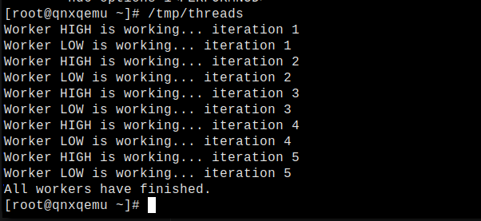

# Day 3: Processes & Threads in QNX

In a Real-Time Operating System (RTOS) like QNX, understanding how tasks are executed is critical. Today we dive into the fundamental units of execution: **Processes** and **Threads**.

## 1. Process vs. Thread (The QNX Way)

- **Process**: A container for resources (memory, file descriptors). A process doesn't "run"; its threads do.
- **Thread**: The smallest unit of execution. In QNX, all threads are **kernel threads**. This means the microkernel knows about every single thread in the system and schedules them directly.

## 2. Priority-Based Preemptive Scheduling

QNX uses **Priority-Based Preemptive Scheduling**.
- Each thread has a priority (0 to 255). Higher numbers = higher priority.
- The highest priority **READY** thread always runs.
- **Preemptive** means if a high-priority thread becomes ready, the kernel immediately stops the lower-priority thread to let the high-priority one run.

## 3. Unique Thread States

Unlike Linux, where threads are mostly just "Running" or "Sleeping," QNX has specific states that tell you exactly why a thread is blocked. This is key for debugging IPC (Message Passing) later:

- **READY**: Waiting for the CPU.
- **RUNNING**: Currently using the CPU.
- **RECEIVE-blocked**: Waiting for someone to send it a message.
- **SEND-blocked**: Sent a message, but the receiver hasn't received it yet.
- **REPLY-blocked**: The receiver got the message but hasn't replied yet.

## 4. Scheduling Policies

1. **FIFO (First-In, First-Out)**: A thread runs until it blocks or a higher priority thread preempts it.
2. **Round Robin**: Like FIFO, but the thread has a "timeslice." If it runs too long, it's moved to the back of the line for its priority level.

---

## 🏁 Day 3 Mission: Multi-threaded Priority

Your goal is to create two threads with different priorities and see who wins the CPU.

### Step 1: Write the code (`threads.c`)

```c
#include <stdio.h>
#include <pthread.h>
#include <sched.h>
#include <unistd.h>

void* worker(void* arg) {
    char* name = (char*)arg;
    for (int i = 0; i < 5; i++) {
        printf("Thread %s is working...\n", name);
        sleep(1);
    }
    return NULL;
}

int main() {
    pthread_t thread1, thread2;
    struct sched_param param;
    pthread_attr_t attr;

    pthread_attr_init(&attr);
    pthread_attr_setinheritsched(&attr, PTHREAD_EXPLICIT_SCHED);

    // Create High Priority Thread (Priority 20)
    param.sched_priority = 20;
    pthread_attr_setschedparam(&attr, &param);
    pthread_create(&thread1, &attr, worker, "HIGH");

    // Create Low Priority Thread (Priority 10)
    param.sched_priority = 10;
    pthread_attr_setschedparam(&attr, &param);
    pthread_create(&thread2, &attr, worker, "LOW");

    pthread_join(thread1, NULL);
    pthread_join(thread2, NULL);

    return 0;
}
```

### Step 2: Compile and Run
1. Compile using `qcc` (remember the Day 2 steps).
2. Transfer to QNX.
3. **Observation**: While the program is running, open another terminal in QNX and run:
   ```bash
   pidin -p <PID_OF_YOUR_APP> threads
   ```
   *Note: Replace `<PID_OF_YOUR_APP>` with the actual PID of your running program.*

### Step 3: Analysis
Look at the `pidin` output. Can you see the two threads? Do they have the priorities you assigned (10 and 20)?

**Worker 1 and worker 2 are running sequentially**
