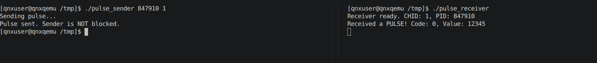

# Day 5: IPC - Pulses & Shared Memory

On Day 4, we learned about synchronous Message Passing. Today, we look at the alternatives for when you don't want to block the sender or when you need to move massive amounts of data.

## 1. Pulses: The Asynchronous Signal

A **Pulse** is a special type of message that is:
- **Non-blocking**: The sender (`MsgSendPulse`) sends it and continues immediately.
- **Fixed-size**: It only carries a small payload (8-bit code and 32-bit/64-bit value).
- **Asynchronous**: It is queued by the kernel on the receiver's channel.

### Why use Pulses?
- **Interrupt Handlers**: Hardware interrupts cannot block; they use pulses to notify a driver.
- **Timers**: When a timer expires, it sends a pulse to your program.
- **Event Notification**: Letting a process know "something happened" without waiting for it to finish.

## 2. Shared Memory: The Speed King

Shared Memory is the fastest IPC because once established, the kernel is no longer involved. Data is moved by simply writing to memory addresses.

**Steps**:
1. `shm_open()`: Create or open a shared memory object (appears in `/dev/shmem/`).
2. `ftruncate()`: Set the size of the memory block.
3. `mmap()`: Map the shared object into your process's address space.

---

## 🏁 Day 5 Mission: The Pulse Listener

Your goal is to create a program that waits for both messages AND pulses on the same channel. This is how real QNX drivers work!

### The Multi-Event Receiver (`pulse_receiver.c`)

```c
#include <stdio.h>
#include <stdlib.h>
#include <sys/neutrino.h>
#include <sys/iomsg.h>

int main() {
    int chid, rcvid;
    struct _pulse pulse;

    chid = ChannelCreate(0);
    printf("Receiver ready. CHID: %d, PID: %d\n", chid, getpid());

    while (1) {
        // MsgReceive handles both regular messages and pulses
        rcvid = MsgReceive(chid, &pulse, sizeof(pulse), NULL);

        if (rcvid == 0) {
            // It's a Pulse!
            printf("Received a PULSE! Code: %d, Value: %d\n", pulse.code, pulse.value.sival_int);
        } else if (rcvid > 0) {
            // It's a regular Message
            printf("Received a MESSAGE from rcvid %d\n", rcvid);
            MsgReply(rcvid, 0, NULL, 0);
        }
    }
    return 0;
}
```

### The Pulse Sender (`pulse_sender.c`)

```c
#include <stdio.h>
#include <stdlib.h>
#include <sys/neutrino.h>
#include <sys/netmgr.h>

int main(int argc, char **argv) {
    if (argc < 3) {
        printf("Usage: pulse_sender <PID> <CHID>\n");
        return 1;
    }

    int pid = atoi(argv[1]);
    int chid = atoi(argv[2]);

    int coid = ConnectAttach(ND_LOCAL_NODE, pid, chid, _NTO_SIDE_CHANNEL, 0);

    // Send a pulse (Non-blocking!)
    printf("Sending pulse...\n");
    MsgSendPulse(coid, 10, _PULSE_CODE_MINAVAIL, 12345);
    printf("Pulse sent. Sender is NOT blocked.\n");

    return 0;
}
```

### Observation Task
1. Run `pulse_receiver`.
2. Run `pulse_sender`.
3. Notice that the sender finishes immediately, while the receiver processes the pulse.
4. Try to find your shared memory objects in QNX by running `ls /dev/shmem`.

**Pulse_receiver created a connect with PID 847910, pulse_sender sent a pulse to PID 847910.**
