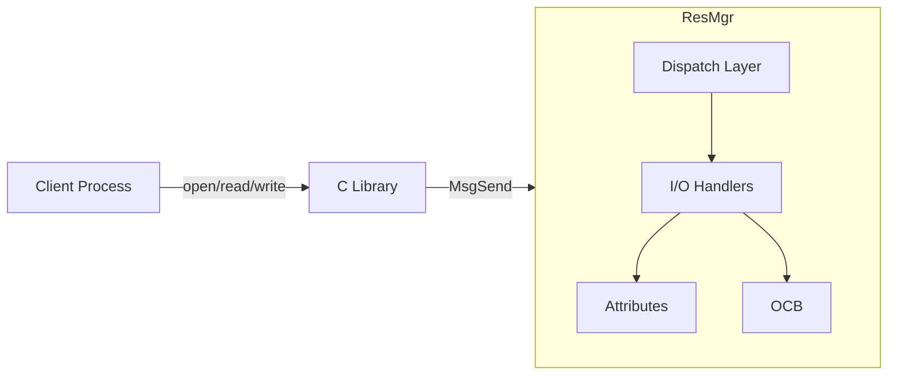

# Day 6: Resource Managers (Part 1) - The Foundation

In QNX, a **Resource Manager** is a user-space process that handles I/O requests from other processes. This is the QNX way of writing "drivers," and it is what makes the Microkernel architecture so robust and flexible.

## 1. The Pathname Space

Standard OSs have a fixed filesystem structure. In QNX, the **pathname space** is dynamic. 
- When a Resource Manager starts, it registers a "mount point" (e.g., `/dev/mydevice`) with the **Process Manager** (`procnto`).
- The Process Manager maintains a table of these names and the IDs (ND, PID, CHID) of the processes that manage them.

## 2. From POSIX Call to QNX Message

When you call `open("/dev/mydevice", O_RDONLY)`, the following happens:
1. **Resolution**: The C Library asks `procnto`: "Who handles `/dev/mydevice`?"
2. **Connection**: `procnto` responds with the PID and CHID of the Resource Manager. The library then creates a connection (`ConnectAttach`).
3. **Communication**: The library sends a specialized QNX message (`_IO_CONNECT`) to the Resource Manager.
4. **Handling**: The Resource Manager receives the message, checks permissions, and replies.

## 3. The Three Pillars of a Resource Manager

To write a Resource Manager, you must understand three key structures:

### A. Attributes Structure (`attr`)
This describes the **device itself**. It stores information like the device size, owner, permissions, and timestamps. There is usually one attribute structure per device name.

### B. OCB (Open Control Block)
This describes the **open session**. Every time a client calls `open()`, a new OCB is created. it stores session-specific data, like the current seek position (`offset`).

### C. I/O Functions
These are the callback functions that handle specific messages:
- `io_read`: Called when a client calls `read()`.
- `io_write`: Called when a client calls `write()`.
- `io_devctl`: Called when a client calls `devctl()` (IOCTL).

---

## 🏁 Day 6 Mission: The Device Map

### Task: Investigate the Namespace
1. Open your QNX terminal.
2. Run `ls -vl /dev`. The `-v` flag is for "verbose." 
3. Look at the output. Can you see the "Process ID" (PID) associated with each device?
   - Who owns `/dev/ser1`?
   - Who owns `/dev/shmem`?
4. Run `pidin -p <PID> fd`. Pick a Resource Manager PID and see which channels it has open.

**Analysis Question:**
If you kill a Resource Manager (e.g., `slay devc-ser8250`), what happens to the entry in `/dev/ser1`? Does the system crash?

**Submit your observations! Tomorrow, we build our own device.**
